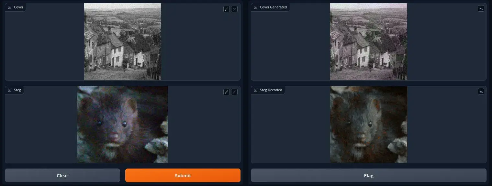

# AI Steg
Hide images inside others using Neural Nets having high bpp (bits per pixel). Inspired by (https://www.warse.org/IJATCSE/static/pdf/file/ijatcse75942020.pdf)



## Installation
- First clone the repository
    ```
    git clone https://github.com/Acedev003/AI_Steg.git
    ```
- Install dependencies
    ```
    pip install -r requirements.txt
    ```
- Run the program
    ```
    cd gradio_app
    python main.py (or python3 main.py)